# Multi-Rate Filters in High-Level Synthesis (HLS)
This project explores different implementation strategies for both classical (single-rate) FIR filters and multi-rate FIR systems using High-Level Synthesis (HLS).
The goal is to analyse how optimisation techniques and architectural decisions influence synthesis results, in particular latency, resource utilisation, and overall implementation efficiency.


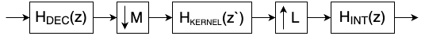

---

## Objective

The objectives of this project are:
- To implement classical FIR filters and a complete multi-rate filter chain entirely in HLS.
- To compare different implementation strategies, including baseline DSP code, HLS-optimised versions, and variants using HLS-specific constructs (e.g., SRLs, pipelining pragmas, loop transformations).
- To analyse how optimisation techniques and architectural choices (pipelining, loop restructuring, filter partitioning) affect synthesis results, latency, and resource utilisation.


---

## Technical parameters

| Parameter | Value |
|-----|-----------|
| Samplerate | 50 kHz |
| Filtertype | FIR |
| fpass | 3,1 kHz |
| fstop | 3,35 kHz |
| Target platform | Xilinx Kria KV260 |
| Toolchain | Xilinx Vivado / Vitis 2024.2 |

---

## HLS Wrapper
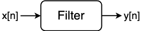


In High-Level Synthesis (HLS), the wrapper serves as the top-level interface between the algorithmic description of the filter and the hardware synthesis environment.
It defines how data is passed into and out of the design, manages streaming or block-based processing, and specifies synthesis directives for interfaces and control signals.

### Purpose
The HLS wrapper encapsulates the FIR or multirate filter implementation and exposes a hardware-compatible interface that can be synthesized into RTL.
It also provides a clear separation between:
- the algorithmic core (pure signal processing logic) and
- the hardware interface layer (AXI, handshake, clock, reset, etc.).

This modular approach simplifies verification and enables consistent reuse of the same filter core in different hardware contexts (e.g., standalone block, IP core, or system integration).

### Structure
A typical HLS wrapper includes:
- Function prototype: defines all top-level ports and their data types
- Interface pragmas: specify the communication type (e.g., AXI stream or AXI Lite)
- Internal call: connects the wrapper to the actual processing function (e.g., fir_core())


### Example

```
void FIR_HLS(hls::stream<short> &input, hls::stream<short> &output){
  #pragma HLS INTERFACE mode=axis port=input
  #pragma HLS INTERFACE mode=axis port=output
  #pragma HLS INTERFACE mode=ap_ctrl_none port=return
  fir_function(input, output);
}
```
- _hls::stream<short> &input_ specifies that the data is available via the _input_ port as a stream in short format, i.e. only one arrives at a time; the same applies to _output_. The direction of the data flow is only determined with the function.
- Since the wrapper function and thus also the main function are required, the interfaces still need to be defined. To do this, _#pragma HLS INTERFACE mode=axis port=input_ is used, which specifies that the input port should be an AXI stream interface.
- The directive _#pragma HLS INTERFACE mode=ap_ctrl_none port=return_ removes the control ports. These are not necessary, as control is data-driven via the Axi Stream interface.

### Benefits
- Provides a consistent hardware interface across all FIR and multirate variants
- Simplifies system integration into larger HLS or RTL environments
- Allows unified testing with the same interface in simulation and synthesis
- Keeps algorithm and interface design cleanly separated

---

## Implementation Variants of FIR Filters
To enable an efficient multirate filter design, the project first investigates several FIR filter architectures.
These single-rate FIR variants form the foundation for the later multirate components (decimator, kernel filter and interpolator).
By implementing and analysing multiple FIR structures in HLS, the goal is to identify architectural trade-offs in terms of performance, latency, resource utilisation, and synthesis behaviour.


### MATLAB FIR Reference Design

Before implementing the FIR filters in HLS, a reference low-pass FIR filter is designed in MATLAB.
This reference design defines the required frequency characteristics and provides the coefficient set used across all HLS implementations (direct form, transposed form, folded, SRL-based, and the later multirate stages).

The filter is created using MATLAB, based on the specified parameters:
- Sample rate: 50 kHz
- Passband frequency: 3.1 kHz
- Stopband frequency: 3.35 kHz
- Filter type: FIR low-pass
- Passband ripple: 0.01
- Stopband ripple: 0.01

**Group delay calculation:**
```math
\text{group\_delay\_samples} = \text{round}\left(\frac{N-1}{2}\right)
```
```math
\text{group\_delay\_time} = \frac{\text{group\_delay\_samples}}{f_s}
```

Where:

- N = 392 (filter length)  
- f_s = 50 kHz (sample rate)

**Calculated values:**

- Group delay: 196 samples  
- Group delay time: 3.92 ms

**Frequency response (magnitude):**  
The resulting magnitude frequency response is shown below and serves as the ground truth for verifying the correctness of all HLS models.

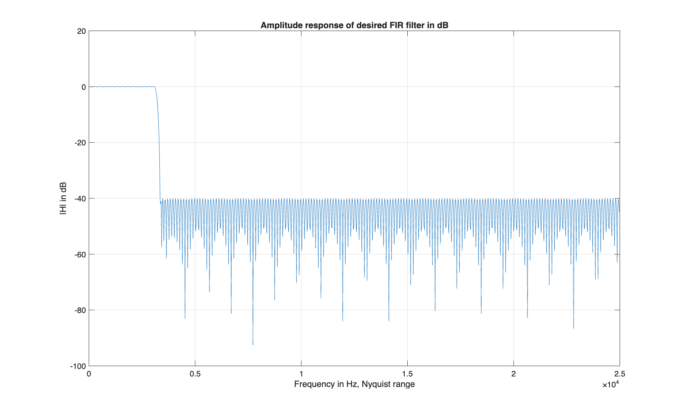


### Direct form FIR filter
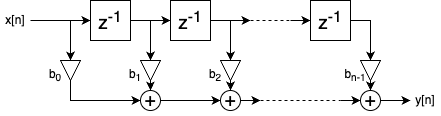

The direct form FIR filter implements the convolution sum directly:
```math
y[n]= \sum_{k=0}^{N−1​}b[k] \cdot x[n−k]
```
Each tap multiplies a delayed version of the input signal by its corresponding coefficient.
The results are summed to produce the output sample. This is the most straightforward FIR implementation and serves as a baseline for performance and resource comparisons in HLS.

#### DSP code of the direct form FIR filter 
A classical DSP implementation of this filter typically uses fixed-point arithmetic with standard C types such as short and int.

```
short FIR_filter(short FIR_delays[], const short FIR_coe[], short int N_delays, short x_n, int shift){
	short i, y;
	int FIR_accu32=0;

	FIR_delays[N_delays-1] = x_n;

	FIR_accu32	= 0;		
	for(i=0; i < N_delays; i++)	
		FIR_accu32 += FIR_delays[N_delays-1-i] * FIR_coe[i];
	
	for(i=1; i < N_delays; i++)				
		FIR_delays[i-1] = FIR_delays[i];

	y = (short) (FIR_accu32 >> shift);
	return y;
}
```

**Notes on DSP Reference Implementation**  

The DSP reference implementation is functional but **not optimized for HLS**.

- **Without HLS pragmas:**  
  - Execution is very slow (latency ~7940 ns)  
  - Resource usage is low (minimal FF, LUT, DSP, BRAM)

- **With HLS pragmas:**  
  - Execution is extremely fast (latency ~80 ns)  
  - Resource usage increases significantly (FF, LUT, and DSP are much higher)

| variant  |  latency [ns] | FF  |  LUT |  BRAM |  DSP |
|---|---|---|---|---|---|
|  normal DSP code 			|  7940  |  167  |  134  |  2  |  1  |
|  DSP code with #pragmas   |  80  |  9259 |  4937 | 0  |  81 |

**Takeaway:** HLS pragmas can dramatically improve performance, but at the cost of significantly higher resource utilisation.


#### HLS-DSP code of the direct form FIR filter 
This version of the direct form FIR filter is **identical in algorithm** to the DSP reference code, but uses **HLS-specific data types** (`ap_fixed`) instead of standard C types.  
This allows HLS to synthesise the design with fixed-point precision, while maintaining bit-accurate behaviour.

```
code
```
- **Without pragmas:**  
  - Functionally equivalent to DSP code  
  - Slow execution due to lack of pipelining  
  - Minimal resource usage  

- **With HLS pragmas:**  
  - Pragmas enable pipelining and loop unrolling  
  - Execution becomes extremely fast  
  - Resource usage increases significantly  

| variant  |  latency [ns] | FF  |  LUT |  BRAM |  DSP |
|---|---|---|---|---|---|
|  normal HLS-DSP code 			|   7910  |  145  |  238  |  1  |  1  |
|  HLS-DSP code with #pragmas   |  60  |  8042  |  4853  |  0  |  81  |

**Takeaway:** The effect of HLS pragmas on performance and resource usage is similar to the DSP reference code: latency is drastically reduced, at the cost of significantly higher hardware utilisation.


#### HLS optimized code of the direct form FIR filter 
In the HLS-optimized version, the two loops from the DSP reference are **merged into a single loop**, enabling **fully pipelined execution**.  
Additionally, HLS-specific **fixed-point types** (`ap_fixed`) are used, eliminating manual shifting and casting.  

```
fir_data_t FIR_filter(delay_data_t FIR_delays[], const coef_data_t FIR_coe[], int N_delays, fir_data_t x_n){
	fir_data_t  y;

	ap_fixed<32,1> FIR_accu32=0;
		
	for(int i= N_delays-1; i >= 0; i--){
		FIR_delays[i] = FIR_delays[i-1];
		FIR_accu32 += FIR_delays[i] * FIR_coe[i];
		}

	FIR_accu32 += x_n * FIR_coe[0];
	FIR_delays[0] = x_n;
	y = FIR_accu32;
	return y;
}
```
**Key Points:**  
- Normal HLS code (without pragmas) already achieves low latency because the merged loops reduce the critical path.
- The normal version is less flexible, as adding pragmas significantly increases resource usage without noticeable performance improvement.
- Using HLS-specific fixed-point types avoids manual shifting and casting and ensures bit-accurate hardware synthesis.


| variant  |  latency [ns] | FF  |  LUT |  BRAM |  DSP |
|---|---|---|---|---|---|
|  normal HLS code 			|  3980  |  150  |  239  |  1  |  2  |
|  HLS code with #pragmas   |  3260 | 5663  |  9408  |  1 |  81  |


**Takeaway:** While pragmas slightly reduce latency, they consume significantly more resources and offer limited practical benefit for this specific HLS-optimized direct form FIR filter.


#### HLS optimized alternative code with SRL of the direct form FIR filter 

In the SRL-based version, the filter uses HLS **Shift Register Logic (SRL) primitives** to implement the shift register efficiently in hardware.  
This eliminates the explicit loop for shifting, leaving only the accumulation loop for computing the FIR output.

```

ap_fixed<32,1> FIR_accu32=0;
fir_shiftreg.shift(input.read());
for(int i= 0; i < N_DELAYS_FIR-1; i++){
	FIR_accu32 += fir_shiftreg.read(i) * b_FIR[i];
}    
output.write(FIR_accu32);

```

**Key Points:**

- SRL handles all data shifting automatically in hardware  
- Only the convolution (accumulation) loop remains  
- Fully pipelined execution  
- Fixed-point types (`ap_fixed` / `ap_int`) are used to ensure bit-accurate synthesis  
- Cannot be implemented as a separate function that takes SRLs as arguments; the SRL-based code must reside directly in the top-level function  


| variant  |  latency [ns] | FF  |  LUT |  BRAM |  DSP |
|---|---|---|---|---|---|
|  normal HLS-SRL code 			|  3970  |  150  |  469 |  0  |  1  |
|  HLS-SRL code with #pragmas   |  3910  |  5574  |  5660 |  0 |  81 |

**Takeaway:** The SRL-based implementation reduces resource usage for shift registers and keeps latency low. Pragmas further improve pipelining slightly, but the main benefit of this variant is efficient hardware utilization for the shift register.


### Transposed form FIR filter
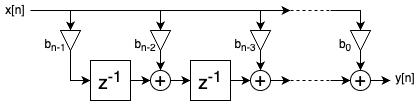

The transposed FIR structure is obtained by **reversing the signal flow** of the direct form.  
Instead of delaying the input samples, the **partial sums** are delayed and accumulated as new input samples arrive.  
This structure is often more suitable for HLS pipelining, as it allows shorter critical paths and better resource utilisation.


```
fir_data_t FIR_filter(accu_data_t FIR_delays[], const coef_data_t FIR_coe[], int N_delays, fir_data_t x_n){
    #pragma HLS PIPELINE
	fir_data_t y;

    y = FIR_delays[0] + x_n * FIR_coe[0];

	for(int i=1; i < N_delays; i++)
		FIR_delays[i-1] = FIR_delays[i] + FIR_coe[i] * x_n;

	return y;
}
```


Key Points:
- Partial sums are delayed instead of input samples
- Fully pipelined execution
- Reduced latency compared to direct form
- Better suited for high-throughput HLS implementations


| variant  |  latency [ns] | FF  |  LUT |  BRAM |  DSP |
|---|---|---|---|---|---|
|  normal HLS code 			|  3960 |  85  |  229 |  2  |  2  |
|  HLS code with #pragmas   |  10 |   3675  |  6760  |  0 |  208  |

**Takeaway:** The transposed form allows extremely low latency when pipelined in HLS. Pragmas have a dramatic effect on speed and also increase resource usage significantly.


### Folded form FIR filter
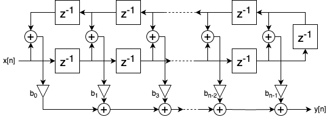

The folded FIR filter is essentially a **Direct Form FIR filter**, but hardware resources are reduced by **exploiting the symmetry of the FIR coefficients**.  
Instead of computing all taps independently, symmetric taps are combined, reducing the number of multiplications required.


```
fir_data_t FIR_filter(delay_data_t FIR_delays[], const coef_data_t FIR_coe[], int N_delays, fir_data_t x_n){

	fir_data_t  y;
	ap_fixed<32,1> FIR_accu32=0;

    FIR_delays[N_delays-1] = x_n;


    for(int i= 0; i < ((N_delays/2) ); i++){
		FIR_accu32 +=  FIR_coe[i] * (FIR_delays[i] + FIR_delays[N_delays -i-1]);
		}

    for(int i=1; i < N_delays; i++)					
        FIR_delays[i-1] = FIR_delays[i];

	y = FIR_accu32;
	return y;
}
```


**Key Points:**  
- Reduces hardware resources by **combining symmetric taps**, thus **fewer multiplications are needed**  
- Functionally equivalent to Direct Form FIR  
- HLS pragmas applied to DSP-style Direct Form FIR **exploit symmetry automatically**, but the overall resource usage remains **similar to the folded version**


| variant  |  latency [ns] | FF  |  LUT |  BRAM |  DSP |
|---|---|---|---|---|---|
|  normal HLS code 			|  5980  | 148  |  154 |  2 |  1 |
|  HLS code with #pragmas   |  60 |  8527  |  5220  |  0  |  81  |


**Takeaway:** Folding exploits coefficient symmetry to save multiplications, reducing resource usage without affecting functional correctness. HLS pragmas on DSP-style Direct Form FIR detect the same opportunities automatically.


### Transposed Folded form FIR filter
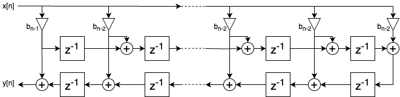

The transposed folded FIR filter reduces hardware resources by reusing functional units (e.g., multipliers and adders) over multiple clock cycles.
Instead of computing all taps in parallel, a smaller number of multipliers is time-multiplexed across the filter taps.


```
transposed folded code
```


**Key Points:**  
- Reduces hardware resources by **combining symmetric taps**, thus **fewer multiplications are needed**  
- Functionally equivalent to Transposed Form FIR  
- HLS pragmas applied to Transposed Form FIR **exploit symmetry automatically**, but the overall resource usage remains **similar to the folded version**
  

| variant  |  latency [ns] | FF  |  LUT |  BRAM |  DSP |
|---|---|---|---|---|---|
|  normal HLS code 			|   |   |   |   |   |
|  HLS code with #pragmas   |   |   |   |   |   |


**Takeaway:** Folding exploits coefficient symmetry to save multiplications, reducing resource usage without affecting functional correctness. HLS pragmas on Transposed Form FIR detect the same opportunities automatically.


### Summary of FIR Variants


| version | variant  |  latency [ns] | FF  |  LUT |  BRAM |  DSP |
|---|---|---|---|---|---|---|
|  Direct FIR DSP |  normal DSP code 			|  7940  |  167  |  134  |  2  |  1  |
|  Direct FIR DSP |  DSP code with #pragmas   	|  80  |  9259 |  4937 | 0  |  81 |
|  Direct FIR DSP |  normal HLS-DSP code 			|   7910  |  145  |  238  |  1  |  1  |
|  Direct FIR DSP |  HLS-DSP code with #pragmas   |  60  |  8042  |  4853  |  0  |  81  |
|  Direct FIR HLS |  normal HLS code 			|  3980  |  150  |  239  |  1  |  2  |
|  Direct FIR HLS |  HLS code with #pragmas     |  3260 | 5663  |  9408  |  1 |  81  |
|  Direct FIR SLR |  normal HLS-SRL code 			|  3970  |  150  |  469 |  0  |  1  |
|  Direct FIR SLR |  HLS-SRL code with #pragmas   |  3910  |  5574  |  5660 |  0 |  81 |
|  Transposed FIR HLS |  normal HLS code 			|  3960 |  85  |  229 |  2  |  2  |
|  Transposed FIR HLS |  HLS code with #pragmas   |  10 |   3675  |  6760  |  0 |  208  |
|  Folded FIR HLS |  normal HLS code 			|  5980  | 148  |  154 |  2 |  1 |
|  Folded FIR HLS |  HLS code with #pragmas   |  60 |  8527  |  5220  |  0  |  81  |


---

## Multirate FIR Filter

After analyzing and optimizing the single-rate FIR architectures, the next step is to implement a **multirate filter system**.  
This system consists of three main components forming a **sample-rate conversion chain**:

- **Decimator** — reduces the sampling rate by factor M after low-pass filtering to prevent aliasing  
- **Kernel Filter** — performs core filtering at the reduced rate for computational savings  
- **Interpolator** — increases the sampling rate by factor L through zero-insertion and low-pass filtering


### Single-Stage Multirate FIR Filter

By splitting the filtering into multiple stages, it is possible to **reduce the size of each individual filter**, which can improve synthesis results and reduce resource usage, while maintaining the same overall filtering effect.
To design the multirate FIR filter efficiently, the optimal decimation/interpolation factor **M** must be determined.
This value minimizes the overall filter order of the three-stage multirate structure.
The optimal factor **M_min** is obtained by solving the following equation:

```math
M^3_{min} \cdot (f^2_{stop}-f^2_{pass}) - M^2_{min} \cdot (f_{stop} + f_{pass})^2 + M_{min} \cdot 2 \cdot F_s \cdot (f_{stop} + f_{pass}) - F_s^2 = 0
```

Using the given parameters:
- f_pass = 3.1 kHz
- f_stop = 3.35 kHz
- F_s = 50 kHz

Solving this equation yields:  
$M_{min} \approx5$

Based on the previous analysis and the design constraints for later cascading, the multirate system uses a decimation/interpolation factor of M=4.
With the optimal multirate factor \(M_{\min}\) determined, the total implementation effort of the multirate filter can be estimated using the following formula:
```math
\text{Total effort } E_{ges} \approx \frac{2}{3} \cdot \log_{10} \left (  \frac{3}{10 \cdot \delta_{pass} \cdot \delta_{stop} } \right ) \cdot \left ( \frac{2\cdot F_s}{F_s - M \cdot (f_{stop}+f_{pass})}+\frac{F_s}{M^2 \cdot (f_{stop}-f_{pass})} \right ) \cdot F_s
```

Using the project parameters:
- $F_s$ ​= 50 kHz
- $f_{pass}$ = 3,1 kHz
- $f_{stop}$ = 3,35 kHz
- $\delta_{pass}$ = 0,01
- $\delta_{stop}$ = 0,01
- M = 4

Substituting these values yields:

$E_{ges} \approx 2,75 \cdot 10^6$

Overall, the multirate architecture reduces the computational effort by a factor of more than 7, corresponding to an effort reduction of roughly 86 % compared to the single-rate implementation.
Following this effort estimate, the multirate filter was implemented in MATLAB to obtain the prototype coefficients and to verify the amplitude response. The resulting amplitude response is shown below:

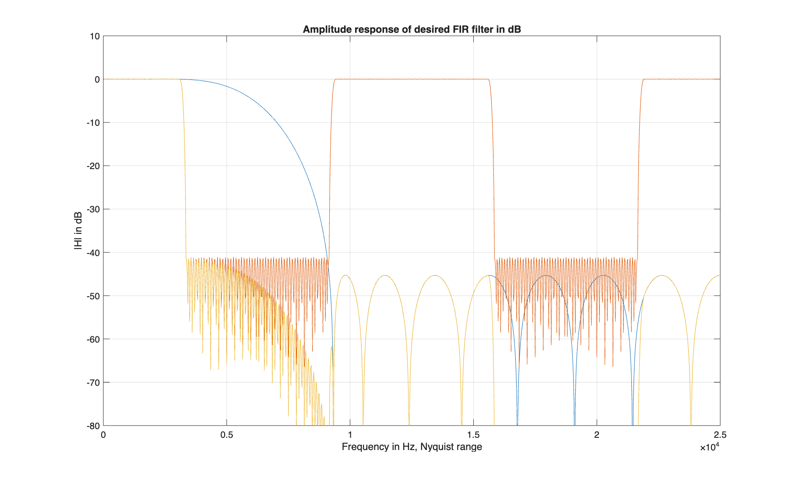


The overall structure is illustrated below:


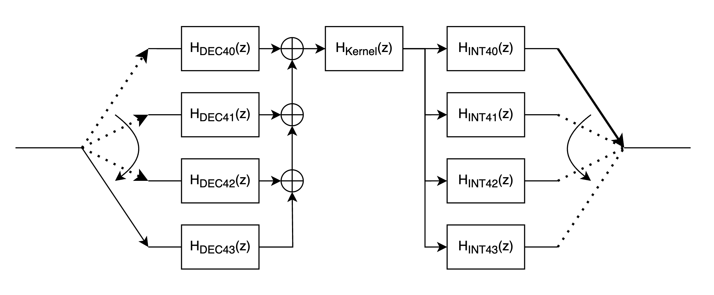


#### Multirate Filter — Variant Combinations

| Variant # | Decimator FIR | Kernel FIR    | Interpolator FIR | Latency [ns] | FF  | LUT  | BRAM | DSP |
|-----------|---------------|---------------|-----------------|--------------|-----|------|-------|-----|
| 1         | Direct        | Direct        | Direct          |   250  |   935  |  1051    |  0  | 10  |
| 2         | Direct        | Transposed    | Direct          |   80   |  1284  |  1885    |  0  | 115 |
| 3         | Transposed    | Direct        | Transposed      |   300  |  5238  |  9340    |  0  | 16  |
| 4         | Transposed    | Transposed    | Transposed      |   120  |  2056  |  1425    |  0  | 111 |


### Cascaded Multirate Filter
The multirate filter can be further optimised by cascading multiple decimation / interpolation stages.  
Instead of applying a single-stage M-fold operation, the cascade splits the overall factor into smaller per-stage factors (e.g., M = M1 · M2 · ...). Each stage therefore requires a much shorter FIR, which reduces coefficient count and implementation complexity.
The following illustration shows the cascaded structure (stage-wise decimation/interpolation with intermediate kernel filters).


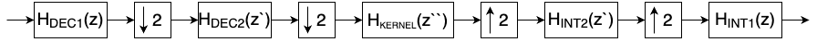


To evaluate the benefit of the cascaded multirate structure, the overall computational effort was estimated using the same metric as in the single-stage analysis.
By splitting the total conversion factor into two stages (e.g., \( M = 4 \rightarrow M_1 = 2, M_2 = 2 \)), each individual filter operates with a wider normalized transition band and therefore requires significantly fewer coefficients.

```math
\text{Total effort } E_{ges} \approx \frac{2}{3} \cdot \log_{10} \left (  \frac{3}{10 \cdot \delta_{pass} \cdot \delta_{stop} } \right ) \cdot \left ( \frac{2\cdot F_s}{F_s - M \cdot (f_{stop}+f_{pass})}+\frac{F_s}{M^2 \cdot (f_{stop}-f_{pass})} \right ) \cdot F_s
```

Using the project parameters:
- $F_s$ ​= 50 kHz
- $f_{pass}$ = 3,1 kHz
- $f_{stop}$ = 3,35 kHz
- $\delta_{pass}$ = 0,01
- $\delta_{stop}$ = 0,01
- M1 = 2
- M2 = 2


As expected, the cascaded design leads to an even lower total effort than the single-stage multirate implementation.
The main reason is that both stages operate on progressively reduced sampling rates, which drastically reduces the number of operations needed per output sample.


Each filter stage of the cascade was designed in MATLAB according to the required passband and stopband specifications.
The resulting amplitude response of the complete cascaded system is shown in the figure below:


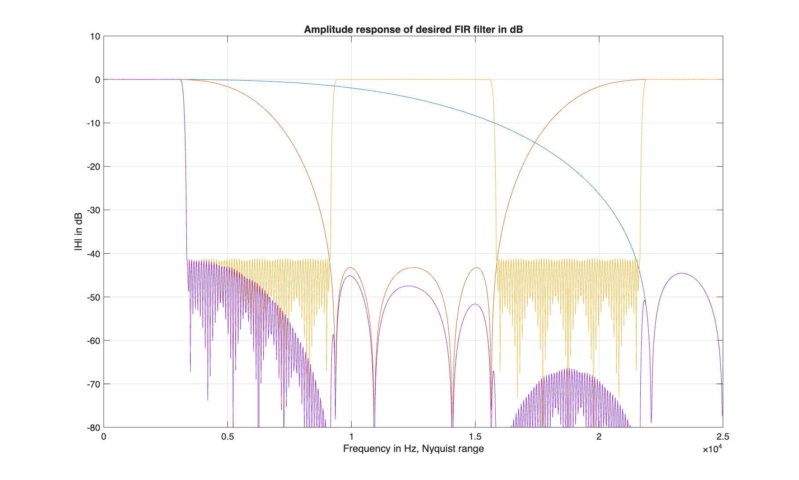


### Halfband Multirate Filter
A further improvement of the multirate cascade can be achieved by replacing individual stages with Halfband filters.
Halfband filters are highly attractive in multirate systems because:
- every second coefficient is exactly zero
- the transition band is centered around one quarter of the sampling frequency,
- they naturally support upsampling or downsampling by a factor of two.

Because of these properties, a Halfband filter requires only about **50% of the multiplications** of an equivalent full-band FIR filter.  
When used inside a multistage decimation or interpolation chain, this leads to a substantial further reduction of computational effort.


To evaluate the benefit of the cascaded halfband multirate structure, the overall computational effort was estimated using the same metric as in the single-stage analysis.

```math
\text{Total effort } E_{ges} \approx \frac{2}{3} \cdot \log_{10} \left (  \frac{3}{10 \cdot \delta_{pass} \cdot \delta_{stop} } \right ) \cdot \left ( \frac{2\cdot F_s}{F_s - M \cdot (f_{stop}+f_{pass})}+\frac{F_s}{M^2 \cdot (f_{stop}-f_{pass})} \right ) \cdot F_s
```

Using the project parameters:
- $F_s$ ​= 50 kHz
- $f_{pass}$ = 3,1 kHz
- $f_{stop}$ = 3,35 kHz
- $\delta_{pass}$ = 0,01
- $\delta_{stop}$ = 0,01
- M1 = 2
- M2 = 2


Each Halfband stage was designed in MATLAB using the required passband and stopband ripple constraints.
The complete system response of the cascaded Halfband architecture is shown in the following figure:
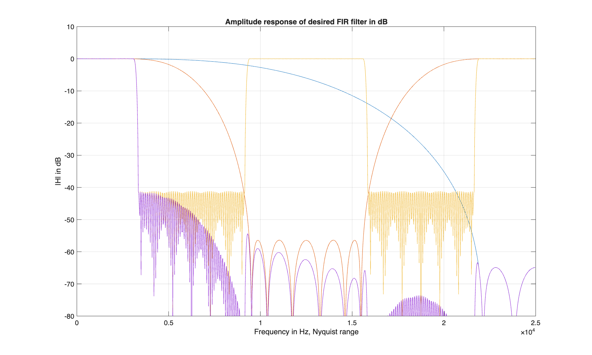


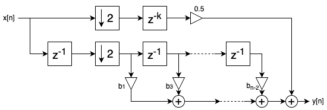


---

## Testbench
Each HLS variant includes a dedicated **C++ testbench** that verifies the functional correctness of the filter design against MATLAB-generated reference data.

### Test Flow

1. **Input Signal Loading:**
The testbench reads a precomputed test signal from a `.dat` file located in the `Matlab/` directory.  
   Each line of the file represents one sample of the input signal (typically a short or floating-point value).
2. **Filter Execution:**
The main HLS function (e.g., HLS_FIR() ) is called with the loaded samples as input.
The testbench processes all samples sequentially and stores the output in a results buffer.
3. **Reference Comparison:**
After processing, the testbench loads the expected output values from a `.res` file located in the `Matlab/` directory and compares them with the HLS results.
The comparison can be based on absolute error, mean squared error (MSE), or a tolerance threshold.
4. **Result Reporting:**
The testbench prints a concise summary to the console, including the number of mismatches and the overall pass/fail status:
```
---------------------------------------
Testbench Results
Samples processed: 1024
Mismatches: 0
Status: PASS ✅
---------------------------------------
```

### Integration with HLS
During synthesis, this testbench is used for both C-simulation and C/RTL co-simulation in Vitis HLS.
It allows functional validation before synthesis and direct comparison between the C++ model and the generated HDL implementation.

---

## Hardware Architecture
The hardware implementation was deployed on a **Xilinx Kria KV260 Vision AI Starter Kit**, which provides a Zynq UltraScale+ MPSoC.
The FIR and multirate filters were synthesized as HLS IP cores and integrated into the programmable logic region of the KV260.

### Physical Hardware Setup

The system consists of:

- **Kria KV260 FPGA Module**  
  - Zynq UltraScale+ MPSoC  
  - Programmable logic used for all FIR / multirate filter implementations    

- **Digilent Pmod I2S2**  
  - Used as the audio interface for real input/output testing  
  - Provides I2S line input and line output  
  - Connected to the KV260 through the PMOD expansion header  

The Pmod I2S2 streams audio samples directly into the filter IP via an AXI-Stream data path.


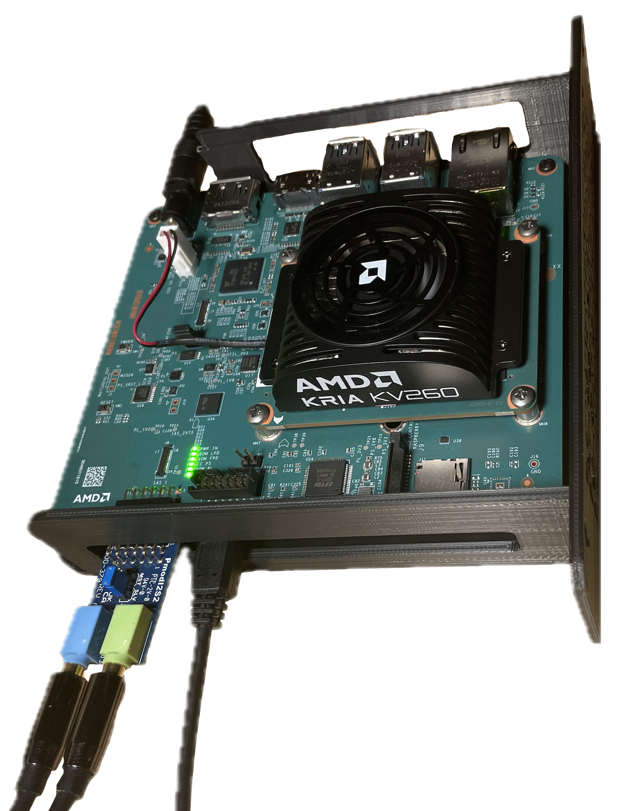

---

## Hardware Verification and On-Board Evaluation

All FIR and multirate filters were synthesized as HLS IP cores and inserted into a fixed audio-processing pipeline on the Kria KV260.
The pipeline is fed by the **Pmod I2S2** interface, which provides streaming audio samples from the line input and transmits the processed samples back to the line output.

### Hardware Pipeline Structure

The complete hardware chain consists of:

1. **Pmod I2S2 interface block**  
   Converts the I2S stream into AXI4-Stream data for the FPGA fabric.

2. **Filter IP Core (HLS-generated)**  
   Processes each audio sample in real time.  
   All filter variants share the same streaming interface, making them fully interchangeable.

3. **Output I2S block**  
   Converts the filtered AXI stream back into I2S for playback on the Pmod output.

Because every filter implementation exposes an identical AXI4-Stream input/output interface, the IP cores could be swapped inside the pipeline **without any structural changes**.
This allowed each architecture — direct form, transposed, folded, multirate, cascaded, and Halfband — to be tested under identical runtime conditions.

### Hardware Measurement and Runtime Analysis

To verify the real-time behavior and frequency response of the implemented filters, two measurement approaches were used:

#### 1. Frequency Response Measurement  
The analog input and output of the Pmod I2S2 were connected to a **network analyzer**.  
This allowed the complete audio processing chain to be stimulated with swept sine signals (chirp) and the resulting magnitude response to be measured directly on the hardware.

The measured frequency responses matched the MATLAB reference designs with high accuracy.  
Differences between filter architectures (e.g., multirate, cascaded, Halfband) were clearly observable in the measured curves.

#### 2. AXI4-Stream Monitoring via Integrated Logic Analyzer (ILA)  
To ensure correct streaming behavior inside the FPGA fabric, the AXI4-Stream interfaces were observed using a **Vivado ILA core**.

The ILA capture confirmed:
- continuous, gap-free sample flow,
- correct VALID/READY handshake,
- no backpressure or stalled cycles,
- stable sample timing during all filter variants.

The ILA was specifically used to compare latency and internal timing differences between the filter architectures.
Because every filter shared the same interface, the AXI stream behavior could be evaluated consistently across all implementations.


---


### Detailed Hardware Observations for Selected Filter Architectures

During the on-board evaluation, five representative filter architectures were examined in more detail.  
Although all variants shared the same AXI4-Stream interface and integrated seamlessly into the audio pipeline, their behavior during live operation revealed clear architectural differences.

#### 1. Direct Form FIR
The direct-form FIR displayed the highest overall resource usage for a fully parallel implementation.  
In real-time playback, it showed:
- stable and predictable latency,
- very low group delay variation,
- a frequency response that matched the MATLAB reference almost exactly.

However, the long adder chain in the direct structure resulted in the highest critical path among all single-rate implementations.

#### 2. Transposed Form FIR
The transposed architecture achieved:
- significantly improved pipelining,
- reduced critical path length,
- more efficient mapping onto DSP slices.

On hardware, this resulted in noticeably lower latency and better timing margins.  
Its measured frequency response matched the direct-form implementation, but with a cleaner AXI-stream timing profile captured in the ILA.

#### 3. Multirate FIR (Decimator – Kernel – Interpolator)
The multirate structure reduced the internal processing rate and therefore:
- achieved the largest computational savings,
- showed the lowest DSP usage relative to its frequency selectivity,
- produced a very smooth and stable output signal.

Hardware measurements showed a frequency response nearly identical to the single-rate versions, but with significantly reduced filter order and power consumption.  
The AXI stream exhibited short bursts of activity corresponding to the decimation/interpolation behavior, which were correctly handled by the pipeline.

#### 4. Cascaded Multistage Filter
The cascaded version split the filtering task across multiple smaller stages.  
This provided:
- a substantial reduction in required filter order per stage,
- improved numerical stability,
- shorter combinational paths.

On hardware, the cascaded filter showed excellent timing behavior.  
The frequency response captured with the network analyzer clearly reflected the combined effect of all stages and closely matched the MATLAB design.  
The modular structure also made this variant the easiest to debug and analyze using the ILA.

#### 5. Halfband Cascaded Filter
The Halfband-based implementation was the most efficient structure tested.  
Thanks to its inherent coefficient symmetry and the high number of zero coefficients, it required:
- the fewest multiplications,
- very low DSP usage,
- the shortest latency among the multistage variants.

The hardware measurements confirmed the expected wide transition bands and the characteristic ±0.5 dB ripple at midband.  
AXI streaming remained perfectly continuous even with the aggressive coefficient sparsity, demonstrating the robustness of the HLS-generated IP.

### Summary
The five selected filter variants demonstrated how architectural choices directly impact hardware behavior.  
While all designs performed correctly, the Halfband and multirate/cascaded structures offered the best trade-off between resource usage, latency, and spectral performance during real-time testing.


---

## Conclusion

This project demonstrated how different FIR architectures behave when implemented, synthesized, and executed on real hardware using High-Level Synthesis (HLS).  
By evaluating classical single-rate filters, optimized HLS variants, multirate structures, cascaded designs, and Halfband filters, several key insights were obtained:

1. **Architecture choice directly influences hardware efficiency.**  
   While direct-form FIR filters provide a clean and intuitive structure, their long adder chains result in high critical path delays.  
   Transposed variants, in contrast, map more efficiently to DSP slices and offer significantly better timing performance.

2. **HLS optimizations can dramatically reduce latency, but often at the cost of higher resource usage.**  
   Pipelining and loop unrolling improve throughput but must be applied carefully to balance DSP utilization and area constraints.

3. **Multirate and cascaded filter designs offer the best scalability.**  
   Reducing the internal processing rate or splitting the filter into smaller stages drastically decreases computational cost while maintaining the desired frequency response.  
   These approaches achieved the most favorable ratio of resource usage to performance.

4. **Halfband-based cascades provide exceptional efficiency.**  
   Due to their inherent coefficient symmetry and sparsity, Halfband filters achieve the lowest multiplier count and demonstrate excellent suitability for hardware implementation.

5. **Hardware verification confirmed the theoretical expectations.**  
   Network analyzer measurements aligned precisely with MATLAB reference responses, and AXI4-Stream monitoring using the ILA validated continuous, gap-free real-time operation for all architectures.

Overall, the project highlights the importance of selecting the right filter architecture when targeting FPGA platforms.  
HLS proved to be a powerful tool for rapidly exploring and comparing design alternatives, while the modular IP-core approach enabled seamless on-hardware testing.  
The results show that substantial performance gains and resource savings can be achieved by moving beyond classical FIR structures and leveraging multirate, cascaded, or Halfband implementations.


