# Digital Filters in High-Level Synthesis (HLS)

This project focuses on the design and implementation of digital FIR filters using High-Level Synthesis (HLS) targeting an FPGA platform. Both classical single-rate FIR filters and a complete multi-rate FIR filter chain are implemented entirely in HLS to evaluate different architectural and optimisation approaches.

The main objective is to analyse how various implementation strategies—ranging from straightforward DSP-style descriptions to HLS-optimised designs using tool-specific constructs—affect synthesis results. Particular attention is paid to latency, resource utilisation, and overall implementation efficiency. Optimisation techniques such as pipelining, loop transformations, shift-register-based delay lines (SRLs), and filter partitioning are systematically explored and compared.

All designs are developed for a fixed set of signal-processing requirements, including a sampling rate of 50 kHz and a low-pass FIR filter specification with a passband frequency of 3.1 kHz and a stopband frequency of 3.35 kHz. The target platform is the Xilinx Kria KV260, and the implementation and synthesis are carried out using the Xilinx Vivado / Vitis 2024.2 toolchain.

---

## Overview

- [HLS-Wrapper](#HLS-Wrapper)
- [FIR Filters](#FIR-Filters)
   - [MATLAB FIR Reference Design](#MATLAB-FIR-Reference-Design)
   - [Direct form FIR filter](#Direct-form-FIR-filter)
   - [Transposed form FIR filter](#Transposed-form-FIR-filter)
   - [Folded form FIR filter](#Folded-form-FIR-filter)
   - [Transposed Folded form FIR filter](#Transposed-Folded-form-FIR-filter)
   - [Summary of FIR Variants](#Summary-of-FIR-Variants)
- [Multirate FIR Filter](#Multirate-FIR-Filter)
   - [Single-Stage Multirate FIR Filter](#Single-Stage-Multirate-FIR-Filter)
      - [MATLAB Reference Design](#MATLAB-Single-Stage-Multirate-Filter-Reference-Design)  
      - [Multirate Filter — Variant Combinations](#Multirate-Filter-—-Variant-Combinations)
   - [Cascaded Multirate Filter](#Cascaded-Multirate-Filter)
      - [MATLAB Reference Design](#MATLAB-Cascaded-Multirate-Filter-Reference-Design)
      - [Cascade Multirate Filter — Variant Combinations](#Cascade-Multirate-Filter-—-Variant-Combinations)
   - [Halfband Multirate Filter](#Halfband-Multirate-Filter)
      - [MATLAB Reference Design](#MATLAB-Halfband-Multirate-Filter-Reference-Design)
      - [Halfband Multirate Filter — Variant Combinations](#Halfband-Multirate-Filter-—-Variant-Combinations)
- [Software-Testbench](#Software-Testbench)


---

## HLS-Wrapper

The HLS wrapper defines the top-level interface between the filter algorithm and the hardware synthesis environment. It specifies how data is transferred into and out of the design, configures control and interface signals, and enables streaming or block-based processing.

<p align="center" width="100%">
   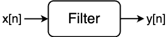
</p>

By encapsulating the FIR or multirate filter core, the wrapper separates the pure signal-processing logic from the hardware interface (e.g., AXI, handshake, clock, reset). This separation simplifies verification, improves reusability, and allows the same filter core to be integrated consistently into different hardware contexts.

### Example

```c
void FIR_HLS(hls::stream<short> &input, hls::stream<short> &output){
  #pragma HLS INTERFACE mode=axis port=input
  #pragma HLS INTERFACE mode=axis port=output
  #pragma HLS INTERFACE mode=ap_ctrl_none port=return
  fir_function(input, output);
}
```

- _hls::stream`<short>` &input_ specifies that the data is available via the _input_ port as a stream in short format, i.e. only one arrives at a time; the same applies to _output_. The direction of the data flow is only determined with the function.
- Since the wrapper function and thus also the main function are required, the interfaces still need to be defined. To do this, _#pragma HLS INTERFACE mode=axis port=input_ is used, which specifies that the input port should be an AXI stream interface.
- The directive _#pragma HLS INTERFACE mode=ap_ctrl_none port=return_ removes the control ports. These are not necessary, as control is data-driven via the Axi Stream interface.

---

## FIR Filters

To enable an efficient multirate filter design, the project first investigates several FIR filter architectures.
These single-rate FIR variants form the foundation for the later multirate components (decimator, kernel filter and interpolator).
By implementing and analysing multiple FIR structures in HLS, the goal is to identify architectural trade-offs in terms of performance, latency, resource utilisation, and synthesis behaviour.

### MATLAB FIR Reference Design

Before implementing the FIR filters in HLS, a reference FIR filter is designed in MATLAB.
This reference design defines the required frequency characteristics and provides the coefficient set used across all single-rate FIR HLS implementations.
The MATLAB script computes the filter order, group delay, and required operations per second directly from the design specifications.
The corresponding MATLAB design script is available here:
[FIR_normal_HLS.m](Matlab/FIR_normal_HLS.m)

**The filter is created based on the specified parameters:**

- Sample rate: 50 kHz
- Passband frequency: 3.1 kHz
- Stopband frequency: 3.35 kHz
- Filter type: FIR low-pass
- Passband ripple: 0.01
- Stopband ripple: 0.01

**The resulting filter characteristics are:**

- Filter order: 391
- Number of taps: 392
- Group delay: 196
- Operations per second: 19.600.000


**Frequency response (magnitude):**  
The resulting magnitude frequency response is shown below and serves as the ground truth for verifying the correctness of all HLS models.

<p align="center" width="100%">
   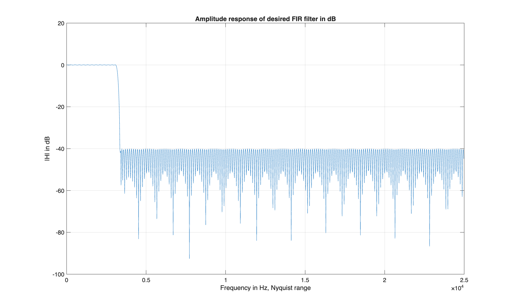
</p>


### Direct form FIR filter

<p align="center" width="100%">
   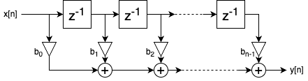
</p>

The direct form FIR filter implements the convolution sum directly. Each tap multiplies a delayed version of the input signal by its corresponding coefficient.
The results are summed to produce the output sample. This is the most straightforward FIR implementation and serves as a baseline for performance and resource comparisons in HLS.

#### DSP code of the direct form FIR filter

A classical DSP implementation of this filter typically uses fixed-point arithmetic with standard C types such as short and int.

```c
short FIR_filter(short FIR_delays[], const short FIR_coe[], short int N_delays, short x_n, int shift){
   short i, y;
   int FIR_accu32=0;

   FIR_delays[N_delays-1] = x_n;

   FIR_accu32 = 0;
   for(i=0; i < N_delays; i++)
      FIR_accu32 += FIR_delays[N_delays-1-i] * FIR_coe[i];

   for(i=1; i < N_delays; i++)
      FIR_delays[i-1] = FIR_delays[i];

   y = (short) (FIR_accu32 >> shift);
   return y;
}
```

**Notes on DSP Reference Implementation**  

The DSP reference implementation is functional but **not optimized for HLS**.

- **Without HLS pragmas:**  
  - Execution is very slow (latency ~7940 ns)  
  - Resource usage is low (minimal FF, LUT, DSP, BRAM)

- **With HLS pragmas:**  
  - Execution is extremely fast (latency ~80 ns)  
  - Resource usage increases significantly (FF, LUT, and DSP are much higher)

| variant  |  latency [ns] | FF  |  LUT |  BRAM |  DSP |
|---|---|---|---|---|---|
|  normal DSP code          |  7940  |  167  |  134  |  2  |  1  |
|  DSP code with #pragmas   |  80  |  9259 |  4937 | 0  |  81 |

**Takeaway:** HLS pragmas can dramatically improve performance, but at the cost of significantly higher resource utilisation.

#### HLS-DSP code of the direct form FIR filter

This version of the direct form FIR filter is **identical in algorithm** to the DSP reference code, but uses **HLS-specific data types** (`ap_fixed`) instead of standard C types.  
This allows HLS to synthesise the design with fixed-point precision, while maintaining bit-accurate behaviour.

```c
code
```

- **Without pragmas:**  
  - Functionally equivalent to DSP code  
  - Slow execution due to lack of pipelining  
  - Minimal resource usage  

- **With HLS pragmas:**  
  - Pragmas enable pipelining and loop unrolling  
  - Execution becomes extremely fast  
  - Resource usage increases significantly  

| variant  |  latency [ns] | FF  |  LUT |  BRAM |  DSP |
|---|---|---|---|---|---|
|  normal HLS-DSP code          |   7910  |  145  |  238  |  1  |  1  |
|  HLS-DSP code with #pragmas   |  60  |  8042  |  4853  |  0  |  81  |

**Takeaway:** The effect of HLS pragmas on performance and resource usage is similar to the DSP reference code: latency is drastically reduced, at the cost of significantly higher hardware utilisation.

#### HLS optimized code of the direct form FIR filter

In the HLS-optimized version, the two loops from the DSP reference are **merged into a single loop**, enabling **fully pipelined execution**.  
Additionally, HLS-specific **fixed-point types** (`ap_fixed`) are used, eliminating manual shifting and casting.  

```c
fir_data_t FIR_filter(delay_data_t FIR_delays[], const coef_data_t FIR_coe[], int N_delays, fir_data_t x_n){
   fir_data_t  y;

   ap_fixed<32,1> FIR_accu32=0;

   for(int i= N_delays-1; i >= 0; i--){
      FIR_delays[i] = FIR_delays[i-1];
      FIR_accu32 += FIR_delays[i] * FIR_coe[i];
   }

   FIR_accu32 += x_n * FIR_coe[0];
   FIR_delays[0] = x_n;
   y = FIR_accu32;
   return y;
}
```

**Key Points:**  

- Normal HLS code (without pragmas) already achieves low latency because the merged loops reduce the critical path.
- The normal version is less flexible, as adding pragmas significantly increases resource usage without noticeable performance improvement.
- Using HLS-specific fixed-point types avoids manual shifting and casting and ensures bit-accurate hardware synthesis.

| variant  |  latency [ns] | FF  |  LUT |  BRAM |  DSP |
|---|---|---|---|---|---|
|  normal HLS code          |  3980  |  150  |  239  |  1  |  2  |
|  HLS code with #pragmas   |  3260 | 5663  |  9408  |  1 |  81  |

**Takeaway:** While pragmas slightly reduce latency, they consume significantly more resources and offer limited practical benefit for this specific HLS-optimized direct form FIR filter.

#### HLS optimized alternative code with SRL of the direct form FIR filter

In the SRL-based version, the filter uses HLS **Shift Register Logic (SRL) primitives** to implement the shift register efficiently in hardware.  
This eliminates the explicit loop for shifting, leaving only the accumulation loop for computing the FIR output.

```c
ap_fixed<32,1> FIR_accu32=0;
fir_shiftreg.shift(input.read());
for(int i= 0; i < N_DELAYS_FIR-1; i++){
   FIR_accu32 += fir_shiftreg.read(i) * b_FIR[i];
}    
output.write(FIR_accu32);
```

**Key Points:**

- SRL handles all data shifting automatically in hardware  
- Only the convolution (accumulation) loop remains  
- Fully pipelined execution  
- Fixed-point types (`ap_fixed` / `ap_int`) are used to ensure bit-accurate synthesis  
- Cannot be implemented as a separate function that takes SRLs as arguments; the SRL-based code must reside directly in the top-level function  

| variant  |  latency [ns] | FF  |  LUT |  BRAM |  DSP |
|---|---|---|---|---|---|
|  normal HLS-SRL code          |  3970  |  150  |  469 |  0  |  1  |
|  HLS-SRL code with #pragmas   |  3910  |  5574  |  5660 |  0 |  81 |

**Takeaway:** The SRL-based implementation reduces resource usage for shift registers and keeps latency low. Pragmas further improve pipelining slightly, but the main benefit of this variant is efficient hardware utilization for the shift register.

### Transposed form FIR filter

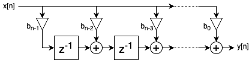

The transposed FIR structure is obtained by **reversing the signal flow** of the direct form.  
Instead of delaying the input samples, the **partial sums** are delayed and accumulated as new input samples arrive.  
This structure is often more suitable for HLS pipelining, as it allows shorter critical paths and better resource utilisation.

```c
fir_data_t FIR_filter(accu_data_t FIR_delays[], const coef_data_t FIR_coe[], int N_delays, fir_data_t x_n){
    #pragma HLS PIPELINE
   fir_data_t y;

   y = FIR_delays[0] + x_n * FIR_coe[0];

   for(int i=1; i < N_delays; i++)
      FIR_delays[i-1] = FIR_delays[i] + FIR_coe[i] * x_n;

   return y;
}
```

Key Points:

- Partial sums are delayed instead of input samples
- Fully pipelined execution
- Reduced latency compared to direct form
- Better suited for high-throughput HLS implementations

| variant  |  latency [ns] | FF  |  LUT |  BRAM |  DSP |
|---|---|---|---|---|---|
|  normal HLS code          |  3960 |  85  |  229 |  2  |  2  |
|  HLS code with #pragmas   |  10 |   3675  |  6760  |  0 |  208  |

**Takeaway:** The transposed form allows extremely low latency when pipelined in HLS. Pragmas have a dramatic effect on speed and also increase resource usage significantly.

### Folded form FIR filter

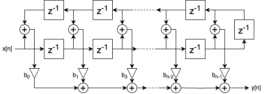

The folded FIR filter is essentially a **Direct Form FIR filter**, but hardware resources are reduced by **exploiting the symmetry of the FIR coefficients**.  
Instead of computing all taps independently, symmetric taps are combined, reducing the number of multiplications required.

```c
fir_data_t FIR_filter(delay_data_t FIR_delays[], const coef_data_t FIR_coe[], int N_delays, fir_data_t x_n){

   fir_data_t  y;
   ap_fixed<32,1> FIR_accu32=0;

    FIR_delays[N_delays-1] = x_n;


   for(int i= 0; i < ((N_delays/2) ); i++){
      FIR_accu32 +=  FIR_coe[i] * (FIR_delays[i] + FIR_delays[N_delays -i-1]);
   }

    for(int i=1; i < N_delays; i++)
        FIR_delays[i-1] = FIR_delays[i];

   y = FIR_accu32;
   return y;
}
```

**Key Points:**  

- Reduces hardware resources by **combining symmetric taps**, thus **fewer multiplications are needed**  
- Functionally equivalent to Direct Form FIR  
- HLS pragmas applied to DSP-style Direct Form FIR **exploit symmetry automatically**, but the overall resource usage remains **similar to the folded version**

| variant  |  latency [ns] | FF  |  LUT |  BRAM |  DSP |
|---|---|---|---|---|---|
|  normal HLS code          |  5980  | 148  |  154 |  2 |  1 |
|  HLS code with #pragmas   |  60 |  8527  |  5220  |  0  |  81  |

**Takeaway:** Folding exploits coefficient symmetry to save multiplications, reducing resource usage without affecting functional correctness. HLS pragmas on DSP-style Direct Form FIR detect the same opportunities automatically.

### Transposed Folded form FIR filter

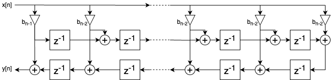

The transposed folded FIR filter reduces hardware resources by reusing functional units (e.g., multipliers and adders).

```c
fir_data_t FIR_filter(delay_data_t FIR_delays[], const coef_data_t FIR_coe[], int N_delays, fir_data_t x_n){

   fir_data_t  y;
   ap_fixed<32,1> FIR_accu32=0;

   FIR_delays[N_delays-1] = x_n;

   for(int i= 0; i < ((N_delays/2) ); i++){
      FIR_accu32 +=  FIR_coe[i] * (FIR_delays[i] + FIR_delays[N_delays -i-1]);
   }

   for(int i=1; i < N_delays; i++)
       FIR_delays[i-1] = FIR_delays[i];

   y = FIR_accu32;
   return y;
}
```

```c
transposed folded code
```

**Key Points:**  

- Reduces hardware resources by **combining symmetric taps**, thus **fewer multiplications are needed**  
- Functionally equivalent to Transposed Form FIR  
- HLS pragmas applied to Transposed Form FIR **exploit symmetry automatically**, but the overall resource usage remains **similar to the folded version**
  
| variant  |  latency [ns] | FF  |  LUT |  BRAM |  DSP |
|---|---|---|---|---|---|
|  normal HLS code          |   |   |   |   |   |
|  HLS code with #pragmas   |   |   |   |   |   |

**Takeaway:** Folding exploits coefficient symmetry to save multiplications, reducing resource usage without affecting functional correctness. HLS pragmas on Transposed Form FIR detect the same opportunities automatically.

### Summary of FIR Variants

| version | variant  |  latency [ns] | FF  |  LUT |  BRAM |  DSP |
|---|---|---|---|---|---|---|
|  Direct FIR DSP |  normal DSP code            |  7940  |  167  |  134  |  2  |  1  |
|  Direct FIR DSP |  DSP code with #pragmas     |  80  |  9259 |  4937 | 0  |  81 |
|  Direct FIR DSP |  normal HLS-DSP code        |   7910  |  145  |  238  |  1  |  1  |
|  Direct FIR DSP |  HLS-DSP code with #pragmas |  60  |  8042  |  4853  |  0  |  81  |
|  Direct FIR HLS |  normal HLS code            |  3980  |  150  |  239  |  1  |  2  |
|  Direct FIR HLS |  HLS code with #pragmas     |  3260 | 5663  |  9408  |  1 |  81  |
|  Direct FIR SLR |  normal HLS-SRL code        |  3970  |  150  |  469 |  0  |  1  |
|  Direct FIR SLR |  HLS-SRL code with #pragmas |  3910  |  5574  |  5660 |  0 |  81 |
|  Transposed FIR HLS |  normal HLS code        |  3960 |  85  |  229 |  2  |  2  |
|  Transposed FIR HLS |  HLS code with #pragmas |  10 |   3675  |  6760  |  0 |  208  |
|  Folded FIR HLS |  normal HLS code            |  5980  | 148  |  154 |  2 |  1 |
|  Folded FIR HLS |  HLS code with #pragmas     |  60 |  8527  |  5220  |  0  |  81  |

---

## Multirate FIR Filter

After analyzing and optimizing the single-rate FIR architectures, the next step is to implement a **multirate filter system**.  
This system consists of three main components forming a **sample-rate conversion chain**:

- **Decimator** — reduces the sampling rate by factor M after low-pass filtering to prevent aliasing  
- **Kernel Filter** — performs core filtering at the reduced rate for computational savings  
- **Interpolator** — increases the sampling rate by factor L through zero-insertion and low-pass filtering

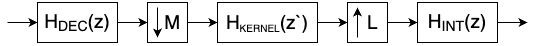

### Single-Stage Multirate FIR Filter

By splitting the filtering into multiple stages, it is possible to **reduce the size of each individual filter**, which can improve synthesis results and reduce resource usage, while maintaining the same overall filtering effect.
To design the multirate FIR filter efficiently, the optimal decimation/interpolation factor **M** must be determined.
This value minimizes the overall filter order of the three-stage multirate structure.
The optimal factor **M_min** is obtained by solving the following equation:

```math
M^3_{min} \cdot (f^2_{stop}-f^2_{pass}) - M^2_{min} \cdot (f_{stop} + f_{pass})^2 + M_{min} \cdot 2 \cdot F_s \cdot (f_{stop} + f_{pass}) - F_s^2 = 0
```

The overall structure is illustrated below:

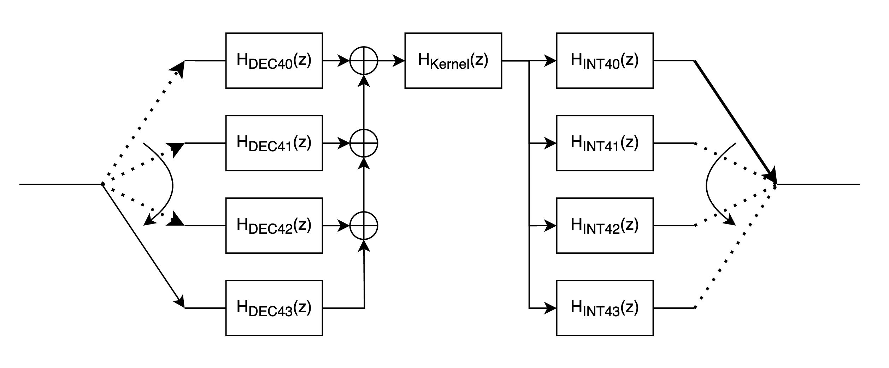


#### MATLAB Single-Stage Multirate Filter Reference Design

Before implementing the single-stage multirate filter in HLS, a multirate FIR low-pass filter is designed in MATLAB. The filter performs a sample-rate change by a factor of M = 4 within a single stage.
The reference design defines the required frequency characteristics and provides the coefficient set used for the single-stage multirate FIR HLS implementation.
The MATLAB script computes the filter order, group delay, and required operations per second directly from the design specifications.
The corresponding MATLAB design script is available here:
[FIR_multirate_HLS.m](Matlab/FIR_multirate_HLS.m)

**The filter is created based on the specified parameters:**

- Sample rate: 50 kHz
- Passband frequency: 3.1 kHz
- Stopband frequency: 3.35 kHz
- Filter type: Multirate FIR low-pass
- Passband ripple: 0.01
- Stopband ripple: 0.01

**The resulting filter characteristics are:**

- Filter order: 136
- Number of taps: 138
- Group delay: 255
- Operations per second: 1.987.500

#### Multirate Filter — Variant Combinations

| Variant # | Decimator FIR | Kernel FIR    | Interpolator FIR | Latency [ns] | FF  | LUT  | BRAM | DSP |
|-----------|---------------|---------------|-----------------|--------------|-----|------|-------|-----|
| 1         | Direct        | Direct        | Direct          |   250  |   935  |  1051    |  0  | 10  |
| 2         | Direct        | Transposed    | Direct          |   80   |  1284  |  1885    |  0  | 115 |
| 3         | Transposed    | Direct        | Transposed      |   300  |  5238  |  9340    |  0  | 16  |
| 4         | Transposed    | Transposed    | Transposed      |   120  |  2056  |  1425    |  0  | 111 |

### Cascaded Multirate Filter

The multirate filter can be further optimised by cascading multiple decimation / interpolation stages.  
Instead of applying a single-stage M-fold operation, the cascade splits the overall factor into smaller per-stage factors (e.g., M = M1 · M2 · ...). Each stage therefore requires a much shorter FIR, which reduces coefficient count and implementation complexity.
The following illustration shows the cascaded structure (stage-wise decimation/interpolation with intermediate kernel filters).

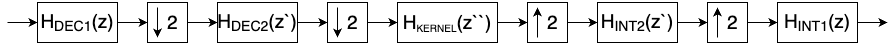


#### MATLAB Cascaded Multirate Filter Reference Design
Before implementing the cascaded multirate filter in HLS, a two-stage halfband FIR decimation chain followed by a kernel FIR filter is designed in MATLAB. Each halfband stage performs a decimation by a factor of M = 2, resulting in a total sample-rate reduction of 4.
The reference design defines the required frequency characteristics and provides the coefficient sets used across all cascaded multirate FIR HLS implementations.
The MATLAB script computes the filter order, group delay, and required operations per second for each filter stage directly from the design specifications.
The corresponding MATLAB design script is available here:
[FIR_cascade_HLS.m](Matlab/FIR_cascade_HLS.m)

**The filter is created based on the specified parameters:**

- Sample rate: 50 kHz
- Passband frequency: 3.1 kHz
- Stopband frequency: 3.35 kHz
- Filter type: Cascaded FIR low-pass
- Passband ripple: 0.01
- Stopband ripple: 0.01

**The resulting filter characteristics are:**

- Filter order: 138
- Number of taps: 141
- Group delay: 276
- Operations per second: 2.125.000

#### Cascade Multirate Filter — Variant Combinations

| Variant # | Decimator FIR | Kernel FIR    | Interpolator FIR | Latency [ns] | FF  | LUT  | BRAM | DSP |
|-----------|---------------|---------------|-----------------|--------------|-----|------|-------|-----|
| 1         | Direct        | Direct        | Direct          |   290  |   4094  |  1970  |  0  |  57 |
| 2         | Direct        | Transposed    | Direct          |   240  |   1725  |  1564    |  0  |  110 |
| 3         | Transposed    | Direct        | Transposed      |     |     |      |    |   |
| 4         | Transposed    | Transposed    | Transposed      |     |     |      |    |   |

### Halfband Multirate Filter

A further improvement of the multirate cascade can be achieved by replacing individual stages with Halfband filters.
Halfband filters are highly attractive in multirate systems because:

- every second coefficient is exactly zero
- the transition band is centered around one quarter of the sampling frequency,
- they naturally support upsampling or downsampling by a factor of two.

Because of these properties, a Halfband filter requires only about **50% of the multiplications** of an equivalent full-band FIR filter.  
When used inside a multistage decimation or interpolation chain, this leads to a substantial further reduction of computational effort.

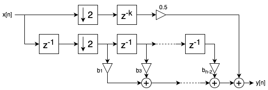

#### MATLAB Halfband Multirate Filter Reference Design
Before implementing the halfband multirate filters in HLS, a two-stage halfband FIR filter chain is designed in MATLAB. Each stage performs a decimation by a factor of M = 2, resulting in a total sample-rate reduction of 4.
The reference design defines the required frequency characteristics and provides the coefficient sets used across all multirate FIR HLS implementations.
The MATLAB script computes the filter order, group delay, and required operations per second for each halfband stage directly from the design specifications.
The corresponding MATLAB design script is available here:
[FIR_halfband_HLS.m](Matlab/FIR_halfband_HLS.m)

**The filter is created based on the specified parameters:**

- Sample rate: 50 kHz
- Passband frequency: 3.1 kHz
- Stopband frequency: 3.35 kHz
- Filter type: Halfband FIR low-pass
- Passband ripple: 0.01
- Stopband ripple: 0.01

**The resulting filter characteristics are:**

- Filter order: 133
- Number of taps: 134
- Group delay: 283
- Operations per second: 1.900.000

#### Halfband Multirate Filter — Variant Combinations

| Variant # | Decimator FIR | Kernel FIR    | Interpolator FIR | Latency [ns] | FF  | LUT  | BRAM | DSP |
|-----------|---------------|---------------|-----------------|--------------|-----|------|-------|-----|
| 1         | Direct        | Direct        | Direct          |   70  |  3398   |  1644    |  0  | 56  |
| 2         | Direct        | Transposed    | Direct          |   70  |   1023  |    1312  |  0  |  109 |
| 3         | Transposed    | Direct        | Transposed      |     |     |      |    |   |
| 4         | Transposed    | Transposed    | Transposed      |     |     |      |    |   |

---

## Software-Testbench

Each HLS variant includes a dedicated **C++ testbench** that verifies the functional correctness of the filter design against MATLAB-generated reference data.

### Test Flow

1. **Input Signal Loading:**
The testbench reads a precomputed test signal from a `.dat` file located in the `Matlab/` directory.  
   Each line of the file represents one sample of the input signal (typically a short or floating-point value).
2. **Filter Execution:**
The main HLS function (e.g., HLS_FIR() ) is called with the loaded samples as input.
The testbench processes all samples sequentially and stores the output in a results buffer.
3. **Reference Comparison:**
After processing, the testbench loads the expected output values from a `.res` file located in the `Matlab/` directory and compares them with the HLS results.
The comparison can be based on absolute error, mean squared error (MSE), or a tolerance threshold.
4. **Result Reporting:**
The testbench prints a concise summary to the console, including the number of mismatches and the overall pass/fail status:

```c
---------------------------------------
Testbench Results
Samples processed: 1024
Mismatches: 0
Status: PASS ✅
---------------------------------------
```

### Integration with HLS

During synthesis, this testbench is used for both C-simulation and C/RTL co-simulation in Vitis HLS.
It allows functional validation before synthesis and direct comparison between the C++ model and the generated HDL implementation.

---

## Hardware Architecture

The hardware implementation was deployed on a **Xilinx Kria KV260 Vision AI Starter Kit**, which provides a Zynq UltraScale+ MPSoC.
The FIR and multirate filters were synthesized as HLS IP cores and integrated into the programmable logic region of the KV260.

### Physical Hardware Setup

The system consists of:

- **Kria KV260 FPGA Module**  
  - Zynq UltraScale+ MPSoC  
  - Programmable logic used for all FIR / multirate filter implementations

- **Digilent Pmod I2S2**  
  - Used as the audio interface for real input/output testing  
  - Provides I2S line input and line output  
  - Connected to the KV260 through the PMOD expansion header  

The Pmod I2S2 streams audio samples directly into the filter IP via an AXI-Stream data path.

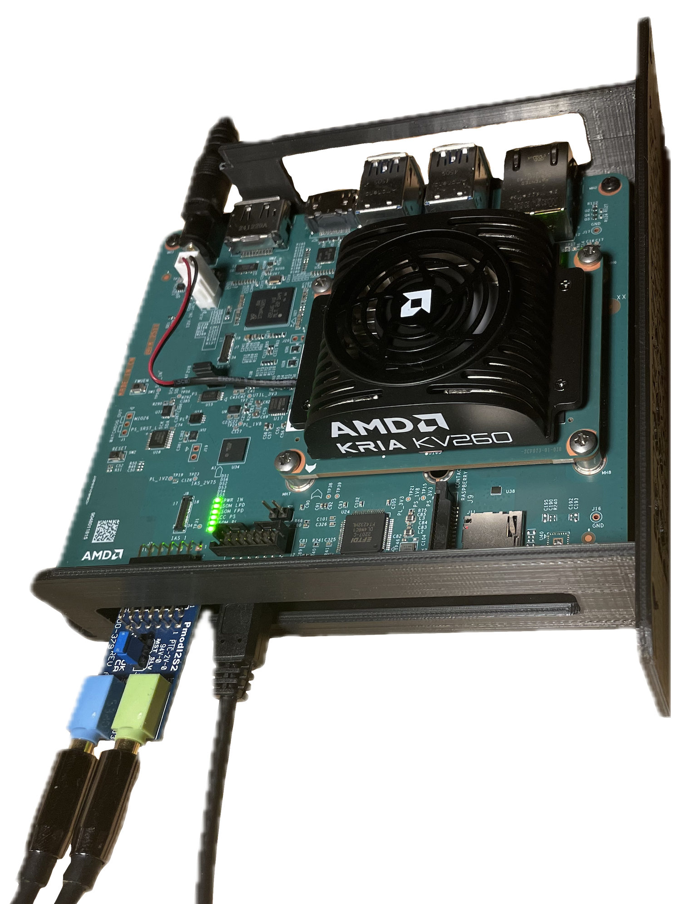

---

## Hardware Verification and On-Board Evaluation

All FIR and multirate filters were synthesized as HLS IP cores and inserted into a fixed audio-processing pipeline on the Kria KV260.
The pipeline is fed by the **Pmod I2S2** interface, which provides streaming audio samples from the line input and transmits the processed samples back to the line output.

### Hardware Pipeline Structure

The complete hardware chain consists of:

1. **Pmod I2S2 interface block**  
   Converts the I2S stream into AXI4-Stream data for the FPGA fabric.

2. **Filter IP Core (HLS-generated)**  
   Processes each audio sample in real time.  
   All filter variants share the same streaming interface, making them fully interchangeable.

3. **Output I2S block**  
   Converts the filtered AXI stream back into I2S for playback on the Pmod output.

Because every filter implementation exposes an identical AXI4-Stream input/output interface, the IP cores could be swapped inside the pipeline **without any structural changes**.
This allowed each architecture — direct form, transposed, folded, multirate, cascaded, and Halfband — to be tested under identical runtime conditions.

### Hardware Measurement and Runtime Analysis

To verify the real-time behavior and frequency response of the implemented filters, two measurement approaches were used:

#### 1. Frequency Response Measurement  

The analog input and output of the Pmod I2S2 were connected to a **network analyzer**.  
This allowed the complete audio processing chain to be stimulated with swept sine signals (chirp) and the resulting magnitude response to be measured directly on the hardware.

The measured frequency responses matched the MATLAB reference designs with high accuracy.  
Differences between filter architectures (e.g., multirate, cascaded, Halfband) were clearly observable in the measured curves.

#### 2. AXI4-Stream Monitoring via Integrated Logic Analyzer (ILA)  

To ensure correct streaming behavior inside the FPGA fabric, the AXI4-Stream interfaces were observed using a **Vivado ILA core**.

The ILA capture confirmed:

- continuous, gap-free sample flow,
- correct VALID/READY handshake,
- no backpressure or stalled cycles,
- stable sample timing during all filter variants.

The ILA was specifically used to compare latency and internal timing differences between the filter architectures.
Because every filter shared the same interface, the AXI stream behavior could be evaluated consistently across all implementations.


---

## Conclusion

This project demonstrated how different FIR architectures behave when implemented, synthesized, and executed on real hardware using High-Level Synthesis (HLS).  
By evaluating classical single-rate filters, optimized HLS variants, multirate structures, cascaded designs, and Halfband filters, several key insights were obtained:

1. **Architecture choice directly influences hardware efficiency.**  
   While direct-form FIR filters provide a clean and intuitive structure, their long adder chains result in high critical path delays.  
   Transposed variants, in contrast, map more efficiently to DSP slices and offer significantly better timing performance.

2. **HLS optimizations can dramatically reduce latency, but often at the cost of higher resource usage.**  
   Pipelining and loop unrolling improve throughput but must be applied carefully to balance DSP utilization and area constraints.

3. **Multirate and cascaded filter designs offer the best scalability.**  
   Reducing the internal processing rate or splitting the filter into smaller stages drastically decreases computational cost while maintaining the desired frequency response.  
   These approaches achieved the most favorable ratio of resource usage to performance.

4. **Halfband-based cascades provide exceptional efficiency.**  
   Due to their inherent coefficient symmetry and sparsity, Halfband filters achieve the lowest multiplier count and demonstrate excellent suitability for hardware implementation.

5. **Hardware verification confirmed the theoretical expectations.**  
   Network analyzer measurements aligned precisely with MATLAB reference responses, and AXI4-Stream monitoring using the ILA validated continuous, gap-free real-time operation for all architectures.

Overall, the project highlights the importance of selecting the right filter architecture when targeting FPGA platforms.  
HLS proved to be a powerful tool for rapidly exploring and comparing design alternatives, while the modular IP-core approach enabled seamless on-hardware testing.  
The results show that substantial performance gains and resource savings can be achieved by moving beyond classical FIR structures and leveraging multirate, cascaded, or Halfband implementations.
